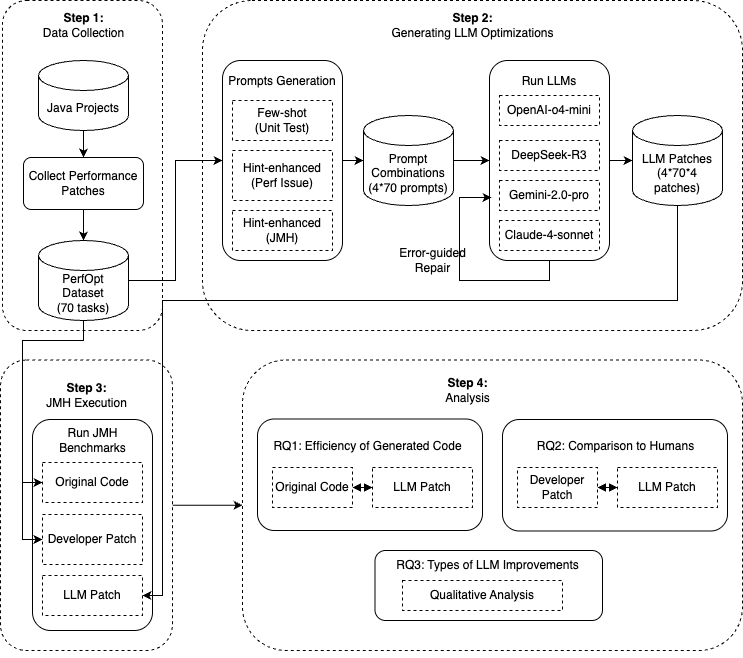

# EvalLLMforJava
EvalLLMforJava is a framework for evaluating Large Language Models (LLMs) on Java code improvement.



## Features

- **Prompting:** Generates prompts from real-world Java repositories and performance issues.
- **Multi-Model Support:** Integrates with popular LLMs such as GPT, DeepSeek, Llama, Gemini, and Claude.
- **Patch Application:** Applies LLM-generated code changes to source files.
- **Testing Pipeline:** Runs unit tests to validate the effectiveness of generated patches.
- **Self-Repair Loop:** (Planned) Attempts automatic repair if initial patch fails tests.
- **JMH Benchmarking:** Integrate [JMH (Java Microbenchmark Harness)](https://openjdk.org/projects/code-tools/jmh/) to measure and compare the performance impact of LLM-generated patches.

## Usage

1. **Install dependencies:**
   ```
   pip install -r requirement.txt
   ```

2. **Generate prompts:**
   ```
   python generate_prompts.py
   ```

3. **Run the pipeline:**
   ```
   python run_pipeline.py
   ```

4. **Review Results:**
   - LLM patch diffs are saved in the `llm_output/` directory.

## Directory Structure

- `baseline/` — Contains original (pre-patch) and developer-improved Java source files for performance comparison.
- `prompts_combinations/` — Prompt files for each repository and commit.
- `llm_output/` — Output diffs from LLM runs.
- `generate_prompts.py` — Script to generate prompt files from real-world Java repositories and documented performance issues. It parses Java source files and issue descriptions, then creates prompt files in `prompts_combinations/` for each relevant commit and file.
- `run_pipeline.py` — Main script to run the evaluation pipeline.
- `call_llms.py` — LLM API integration.
- `apply_llm_changes.py` — Utilities to extract LLM-suggested code changes and apply them as patches to Java source files.
