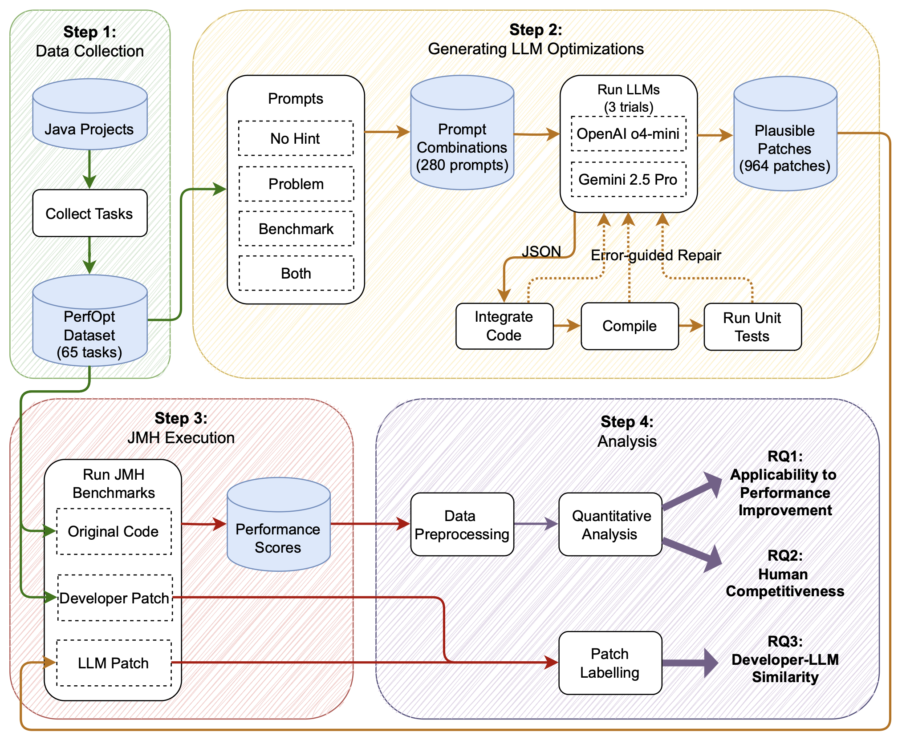

# Do AI Models Dream of Faster Code?
This replication package contains the complete dataset, codebase, and analysis scripts for an experiment evaluating the capabilities of Large Language Models (LLMs) to automatically fix performance issues in large-scale Java projects. The study compares LLM-generated patches against original code baselines and human-developer-written performance patches across four major open-source projects: Kafka, Netty, Presto, and RoaringBitmap.



## Repository Structure

```
.
├── Analysis/         # All scripts for data analysis and visualization
│   ├── preprocessing/  # Scripts for cleaning and normalizing raw benchmark data
│   ├── RQ1/            # Scripts related to Research Question 1
│   └── RQ2/            # Scripts related to Research Question 2
├── Dataset/          # Raw data for benchmarks and LLM outputs
│   ├── baseline_raw/   # Raw JMH benchmark results for original and developer versions
│   └── llm_output_raw/ # LLM-generated patches and raw JMH benchmark results
│   └── PerfOpt/        # The dataset of performance optimization tasks, including PerfOpt.csv
├── Prompts/          # All generated prompt files, organized by project and task ID
├── Scripts/          # Build, test, and benchmark execution scripts
│   └── run_jmh/         # Scripts to run JMH benchmarks for each project
├── apply_llm_changes.py # Applies LLM-generated diffs to the codebase
├── call_llms.py         # Calls LLM APIs to generate solutions
├── generate_prompts.py  # Generates prompts from source files
├── run_pipeline.py      # Automated pipeline to generate LLM patches
└── run_unit_test.py     # Runs unit tests to validate patch plausibility
```

## Experimental Pipeline

1.  **LLM Patches Generation**: The `run_pipeline.py` script automates the patch generation process.
    1.  **LLM Invocation**: The `call_llms.py` script sends the generated prompts to the respective LLM APIs to generate performance patches.
    2.  **Patch Application**: `apply_llm_changes.py` takes the generated diffs and applies them to a clean checkout of the target project's source code.
    3.  **Plausibility Checking**: `run_unit_test.py` compiles the patched code and runs the project's existing test suite to ensure the patch is plausible (i.e., it compiles and passes all tests).

2.  **Benchmarking**: For all plausible patches, the shell scripts in `Scripts/run_jmh/` are used to execute the developer-provided JMH benchmarks and collect performance data.


## Data Analysis

The `Analysis/` directory contains all scripts required to process the raw benchmark data and generate the figures and tables for the paper.

1.  **Preprocessing**

    The scripts in `Analysis/preprocessing/` are the first step. They take the raw JSON output from the JMH benchmarks (stored under `Dataset/baseline_raw` and `Dataset/llm_output_raw`) and perform the following key operations:

    * `normalize_score.py`: Calculates the normalized performance score for every benchmark run.
    * `final_score.py`: Calculates the final representative score with representative benchmark.

2.  **Answering Research Questions**

    The `RQ1` and `RQ2` directories contain the scripts used to generate the final analyses:

    * **RQ1** (`boxplot_summary.py`, `wilcoxon_a12.py`, `generate_model_performance_table.py`):  
      Uses `representative_benchmark_scores.csv` to compare the performance of LLM solutions to the developer and original baselines across models and prompt strategies, generate boxplots, run Wilcoxon/A12 statistical tests, and produce the performance tables.

    * **RQ2** (`class_strategy.py`, `patch_complexity.py`, `qualitative_coding_results.csv`, `inter_rate_label.csv`):  
      Performs qualitative analysis of optimization strategies (Strategy Match / Alignment / Divergence) by prompt, project, and model, and computes patch complexity metrics for developer and LLM patches.


## How to Run

1.  **Clone & Compile Projects**: First, clone the four target Java projects (**Kafka**, **Netty**, **Presto**, **RoaringBitmap**) into a local directory. Follow their respective documentation to compile them and ensure a clean build.

2.  **Install Dependencies**: Install all required Python packages for this repository.
    ```bash
    pip install -r requirement.txt
    ```

3.  **Generate Patches & Check Plausibility**: Execute the main pipeline script. This will call the LLM APIs, generate patches, apply them, and run unit tests.
    ```bash
    python run_pipeline.py
    ```

4.  **Run Benchmarks**: Once plausible patches are generated, run the JMH benchmarks for each project to collect performance data.
    ```bash
    # Example for Kafka
    bash Scripts/run_jmh/kafka.sh
    ```

5.  **Run Analysis**: Finally, execute the analysis scripts located in the `Analysis/` subdirectories to process the raw data and reproduce the figures and tables from the paper.
